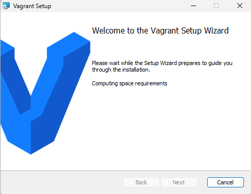
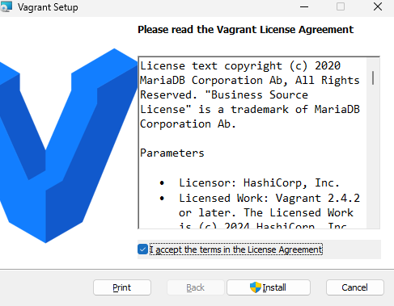
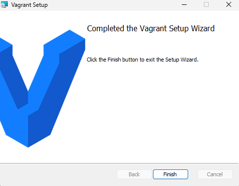
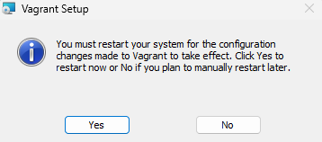

# INSTALLATION DE VAGRANT
Pour choisir votre système d'exploitation et la version de Vagrant à installer, utilisez le lien suivant :
🔗 Téléchargement Vagrant (https://developer.hashicorp.com/vagrant/downloads)

Suivez les étapes d'installation :
1️⃣
2️⃣
3️⃣
4️⃣

Une fois installé, ouvrez un IDE dans le dossier de travail souhaité et exécutez la commande suivante pour initialiser Vagrant. Cela créera un fichier Vagrantfile dans le répertoire.
`vagrant init`

## CRÉATION D'UNE MACHINE VIRTUELLE
Vous pouvez créer une VM de deux manières :

1️⃣ Via le répertoire public de box
Rendez-vous sur Vagrant Cloud https://vagrantcloud.com/boxes/search
Suivez les instructions pour récupérer une image spécifique.

2️⃣ Via un fichier Vagrantfile personnalisé
Configurez votre propre Vagrantfile pour définir la machine virtuelle selon vos besoins.
COMMANDES ESSENTIELLES

🔹 Démarrer une machine virtuelle inscrite dans le Vagrantfile
`vagrant up`

🔹 Vérifier l’état des VM
`vagrant status`

🔹 Arrêter une VM sans la supprimer
`vagrant halt`

🔹 Supprimer une VM définitivement
`vagrant destroy`

🔹 Redémarrer une VM
`vagrant reload`

🔹 Redémarrer une VM en forçant l’approvisionnement (provisioning)
`vagrant reload --provision`

🔹 Se connecter à une VM via SSH
`vagrant ssh [nom_VM]`

🔹 Lister les images (box) installées sur votre machine
`vagrant box list`

📌 D'autres commandes avancées sont disponibles dans la documentation officielle ou en effectuant des recherches plus approfondies.

## CONCLUSION
Dans ce dossier, vous trouverez un exemple de Vagrantfile expliqué pour faciliter la prise en main et la création de vos machines virtuelles.

⚠ Note importante : Vagrant s’appuie sur des outils de virtualisation tels que VirtualBox, VMware, et bien d’autres. Il est donc crucial de vérifier la compatibilité des images (box) avec votre provider avant de les utiliser.

Bon apprentissage et exploration avec Vagrant ! 😊