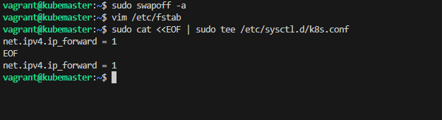
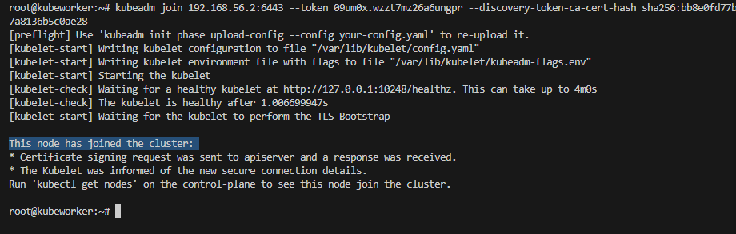

# INSTALLATION CLUSTER KUBERNETES AVEC CALICO COMME CNI

## Creation des VM
```bash
#Utiliser fichier vagrant pour creer vos VM
vagrant validate
vagrant up
vagrant status
```

```bash
# Se connecter a une VM
vagrant ssh "vm_name"
```


## Desactivation du SWAP
```bash
sudo swapoff -a 
vim /etc/fstab # Et commenter la ligne avec 'swap....'
```
## Prerequis installation gestionnanire de container (A faire sur tout les noeuds)
```bash
cat <<EOF | sudo tee /etc/sysctl.d/k8s.conf
net.ipv4.ip_forward = 1
EOF
```



### Application des parametres systctl sans redemarrer
```bash
sudo sysctl --system
### Verification du transfert de paquets definit a 1
sysctl net.ipv4.ip_forward
```


### CRI-O Install instructions
```bash
KUBERNETES_VERSION=v1.32  # Definition des variables qui seront utilisees dans nos commandes
CRIO_VERSION=v1.32
```

```bash
apt-get update
apt-get install -y software-properties-common curl
```


```bash
curl -fsSL https://download.opensuse.org/repositories/isv:/cri-o:/stable:/$CRIO_VERSION/deb/Release.key |
    gpg --dearmor -o /etc/apt/keyrings/cri-o-apt-keyring.gpg
echo "deb [signed-by=/etc/apt/keyrings/cri-o-apt-keyring.gpg] https://download.opensuse.org/repositories/isv:/cri-o:/stable:/$CRIO_VERSION/deb/ /" |
    tee /etc/apt/sources.list.d/cri-o.list
```


```bash
apt-get update
apt-get install -y cri-o  # installation du gestionnaire de conteneurs CRI-O
```


```bash
systemctl start crio.service   # ou utiliser commande "systemctl enable --now crio.service"
```

```bash
# configuration des fonctionnalites reseau pour permettre a k8s de bien gerer son trafic(applications des regles de firewall) venant des ponts
modprobe br_netfilter
echo br_netfilter >> /etc/modules-load.d/crio.conf
modprobe br_netfilter
lsmod | grep -i br_netfilter
```


## Installing kubeadm, kubelet and kubectl (tout les noeuds)
```bash
sudo apt-get update
```

```bash
# telechargement repository officel distant securise et cle publique pour verifier paquets k8s
sudo apt-get install -y apt-transport-https ca-certificates curl gpg
curl -fsSL https://pkgs.k8s.io/core:/stable:/v1.32/deb/Release.key | sudo gpg --dearmor -o /etc/apt/keyrings/kubernetes-apt-keyring.gpg
echo 'deb [signed-by=/etc/apt/keyrings/kubernetes-apt-keyring.gpg] https://pkgs.k8s.io/core:/stable:/v1.32/deb/ /' | sudo tee /etc/apt/sources.list.d/kubernetes.list
```


```bash
sudo apt-get update
sudo apt-get install -y kubelet kubeadm kubectl 
sudo apt-mark hold kubelet kubeadm kubectl          # Bloquer mise a jour automatique de ces paquets 
```


```bash
sudo systemctl enable --now kubelet
```


## Initialisation Cluster
```bash
# Initialisation du cluster en definissant l'addresse du master et le réseau IP interne du cluster pour les pods
kubeadm init --apiserver-advertise-address=192.168.56.2 --pod-network-cidr=10.244.0.0/16 
```


```bash
  # Executer ces commandes pour pouvoir utiliser votre cluster a travers l'utilisateur actuel
  mkdir -p $HOME/.kube # Crée le dossier de configuration kube s'il n'existe pas
  sudo cp -i /etc/kubernetes/admin.conf $HOME/.kube/config  # Copie le fichier de configuration généré par kubeadm
  sudo chown $(id -u):$(id -g) $HOME/.kube/config # Change le propriétaire du fichier pour l'utilisateur actuel
```


## Installation calico (sur le master)

```bash
# Telechargement du fichier calico a modifier/adapter selon configuration reseau cluster
curl https://raw.githubusercontent.com/projectcalico/calico/v3.29.3/manifests/calico.yaml -O
```

```bash
vim calico.yaml     # Chercher cette variable et adapter sa valeur a celle de votre cidr: 'CALICO_IPV4POOL_CIDR'
```


```bash
kubectl apply -f calico.yaml
```


```bash
# Verification cluster initialiser
kubectl get nodes
```


Quitter mode super utilisateur et autoriser l'utilisateur simple a administer cluster
```bash
exit
mkdir -p $HOME/.kube
sudo cp -i /etc/kubernetes/admin.conf $HOME/.kube/config
sudo chown $(id -u):$(id -g) $HOME/.kube/config
```


```bash
# Executer cette commande (sur le master) pour joindre un noeuds a notre cluster
kubeadm token create --print-join-command
```


```bash
# Activation de l'autocompletion 
source <(kubectl completion bash)  
echo "source <(kubectl completion bash)" >> ~/.bashrc 
# Configuration de l'alias
alias k=kubectl
complete -o default -F __start_kubectl k
source ~/.bashrc
```


## Configuration d'un noeud et le joindre au cluster

```bash
# Desactiver swap sur la machine cible
sudo swapoff -a
```
```bash
# Copier le contenu du fichier install_k8s.sh dans celui-ci
vim install.sh
```


```bash
# Atribuer les droits d'execution sur ce fichier
chmod +x install.sh
sudo ./install.sh  # Installation automatique du necessaire
```


```bash
# Joindre le noeud au cluster
kubeadm token create --print-join-command  # Commande a taper sur le master node
kubeadm join 192.168.56.2:6443 --token 09um0x.wzzt7mz26a6ungpr --discovery-token-ca-cert-hash sha256:bb8e0fd77b52a7ea3323a7d8339dd17b22a4dc4b9e54fb56697a8136b5c0ae28  # resultat attendu et a taper sur le noeud 
```



## Reinitiaisation d'un noeud
Creer un fichier 'reset.sh' avec le contenu du fichier reset_k8s.sh puis l'executer sur la machine a reinitialiser
```bash
vim reset.sh
chmod +x reset.sh
./reset.sh
```


Puis refaire les configurations l'etape "joindre noeud au cluster".


************************************** BY HaroldoDevOps237 *******************************************************
## Liens utiles
Lien officiel documentation k8s: https://kubernetes.io/docs/home/
Lien page officielle calico: https://docs.tigera.io/calico/latest/getting-started/kubernetes/self-managed-onprem/onpremises
