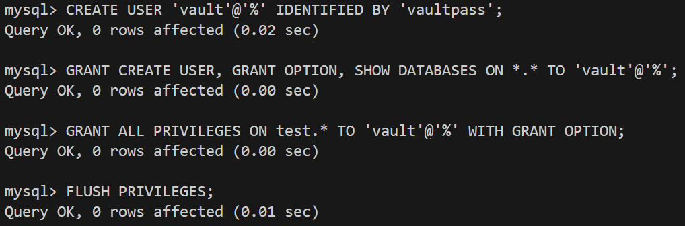
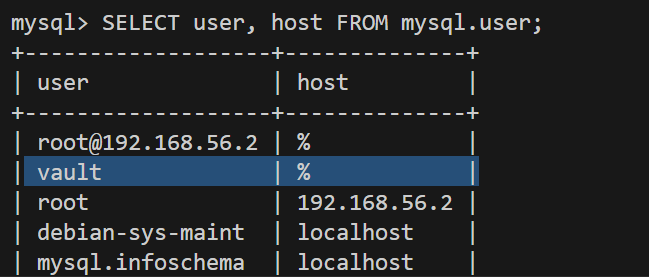
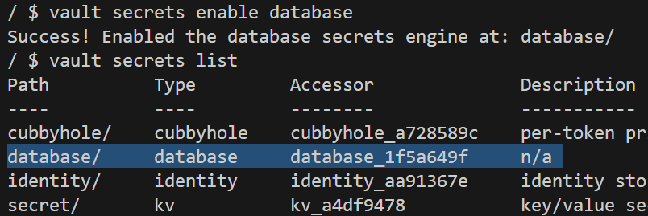
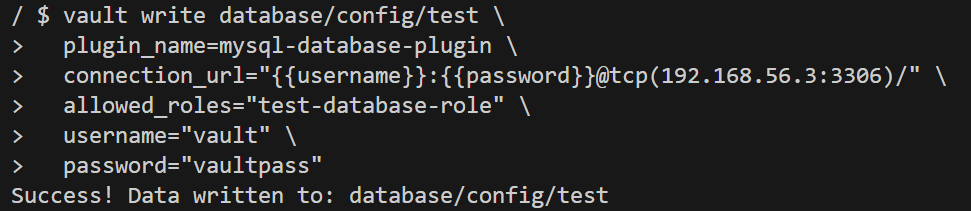
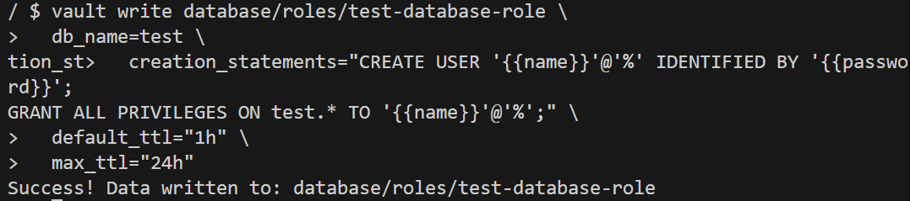
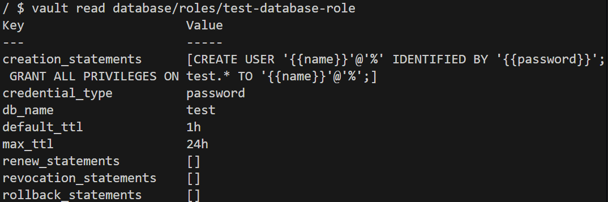
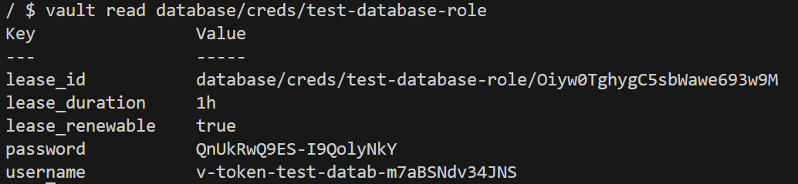
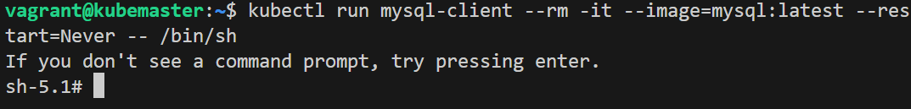
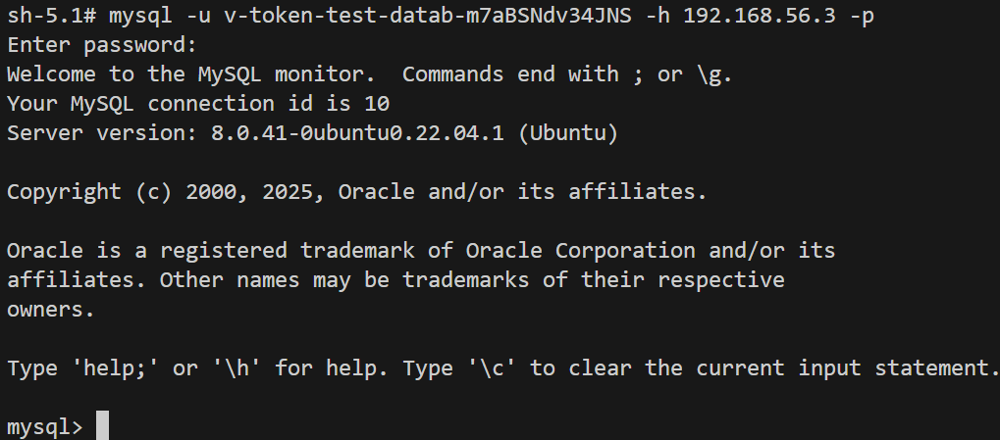

# Tutoriel sur la rotation dynamique de credentials MySQL avec HashiCorp Vault

## Insatallation MySQL-Server
```bash
sudo apt update
sudo apt install mysql-server -y
```

```bash
# Configuration reseau
sudo nano /etc/mysql/mysql.conf.d/mysqld.cnf # bind_adress = 0.0.0.0 permet toutes les connexions
sudo systemctl restart mysql
```

```bash
sudo mysql -u root -p
CREATE DATABASE test;
SHOW DATABASES; #verification
DROP DATABASE 'nom_BD'; #supprimer si besoin
```

## Creation  d'un seul utilisateur générique pour Vault
```bash
CREATE USER 'vault'@'%' IDENTIFIED BY 'vaultpass';
GRANT CREATE USER, GRANT OPTION, SHOW DATABASES ON *.* TO 'vault'@'%'; #Donner les privilèges globaux
GRANT ALL PRIVILEGES ON test.* TO 'vault'@'%' WITH GRANT OPTION; #Donner les privilèges sur la base de données test
FLUSH PRIVILEGES; # Appliquer les changements
```


```bash
SELECT user, host FROM mysql.user; #verification des users creer et/ou presents
SHOW GRANTS FOR 'vault'@'%'; #verification des privileges accorder a 'user'@'pwd'
```


```bash
DROP USER 'vault'@'%'; # Supprimer un user 
```

## Dans VAULT

```bash
vault secrets enable database   # Pour activer
vault secrets disable database  # Pour désactiver
```
```bash
vault secrets list # verifier secrets present
```


### Config connecxion a MySQL
```bash
vault write database/config/test \
  plugin_name=mysql-database-plugin \
  connection_url="{{username}}:{{password}}@tcp(192.168.56.3:3306)/" \
  allowed_roles="test-database-role" \
  username="vault" \
  password="vaultpass"
```


### Creation Role pour la rotation
```bash
vault write database/roles/test-database-role \
  db_name=test \
  creation_statements="CREATE USER '{{name}}'@'%' IDENTIFIED BY '{{password}}'; GRANT ALL PRIVILEGES ON test.* TO '{{name}}'@'%';" \
  default_ttl="1h" \
  max_ttl="24h"
```


```bash
vault read database/roles/test-database-role # verification role
```


```bash
vault read database/creds/test-database-role # creation credential pour connexion
```



### Depuis une machine ou conteneur avec mysql-client 
```bash
kubectl run mysql-client --rm -it --image=mysql:latest --restart=Never -- /bin/sh # creation conteneur avec mysql-client pour test connexion a la BD
```


```bash
# Etablir connexion a la bd depuis le conteneur avec les credentials fournis par VAULT
mysql -u v-token-test-datab-xxxxx -p -h 192.168.56.3
```
Puis entre le mot de passe donne par VAULT


### Renouveler
```bash
vault lease renew database/creds/test-database-role/@lease_ID
```
### Révoquer
```bash
vault lease revoke database/creds/test-database-role/@lease_ID
```
### Supprimer manuellement tout les utilisateurs creer dynamiquement 
```bash
# Liste tout les user puis tapez les commandes qui seront donner
SELECT CONCAT("DROP USER '", user, "'@'", host, "';") 
FROM mysql.user 
WHERE user LIKE 'v-token%';
```